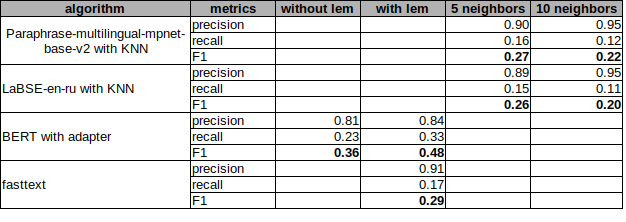

# AITK-352-tech-support-classificator
Обучение классификатора для бота технической поддержки

В этом проекте сравниваются классификаторы:
* на основании fasttext
* sbert (paraphrase-multilingual-mpnet-base-v2) + knn
* BERT + adapter
* tf-idf (gensim)

на задаче классификации входящих вопросов в экспертную поддержку

Первоисточники для некоторых подходов:
https://docs.adapterhub.ml/classes/models/bert.html#transformers.adapters.BertAdapterModel
https://github.com/adapter-hub/adapter-transformers/blob/master/examples/pytorch/text-classification/run_glue.py

